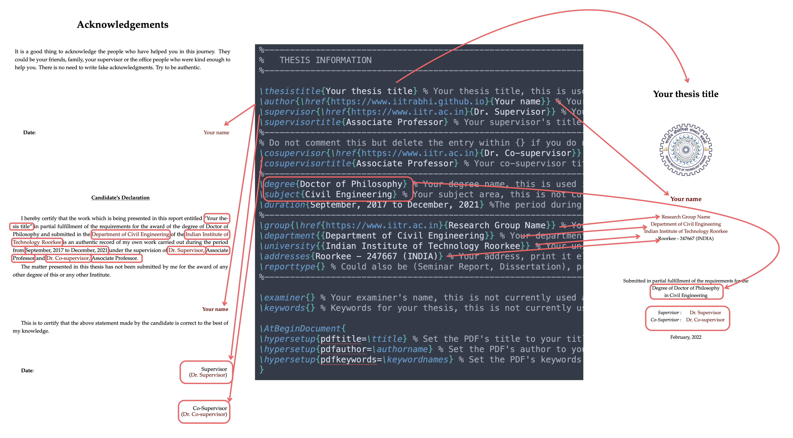

# thesis-phd
Use this template to make your thesis. It satisfies the formatting requirement of thesis of Indian Institute of Technology Roorkee.

You can directly start using this template on Overleaf or if you wish to edit in locally on your personal computer, fork this repo and start making changes.

- Sublime - Latex setup guide: https://www.youtube.com/watch?v=SZEXdXL_P4w

## Thesis Info

- To start working with this thesis, clone the project on your system or download it and then upload the zip file to overleaf.
- Then go-to the file `00.Preamble/thesis-info.tex` and fill in all the details properly. Build the project and start editing your thesis.
- You can comment out individual sections from the project to remove them from the build.

This template will automatically create the `Title Page`, 	`Declaration Page` and `Acknowledgment page` with the data supplied by the student in `00.Preamble/thesis_info.tex` file. Please do not modify the above set of pages manually.

